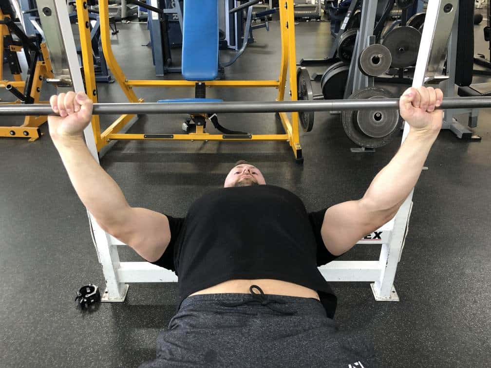
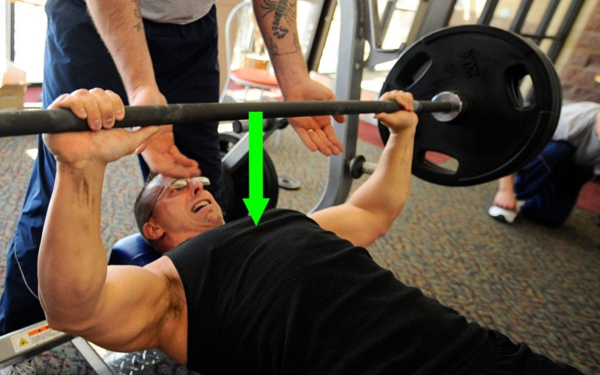
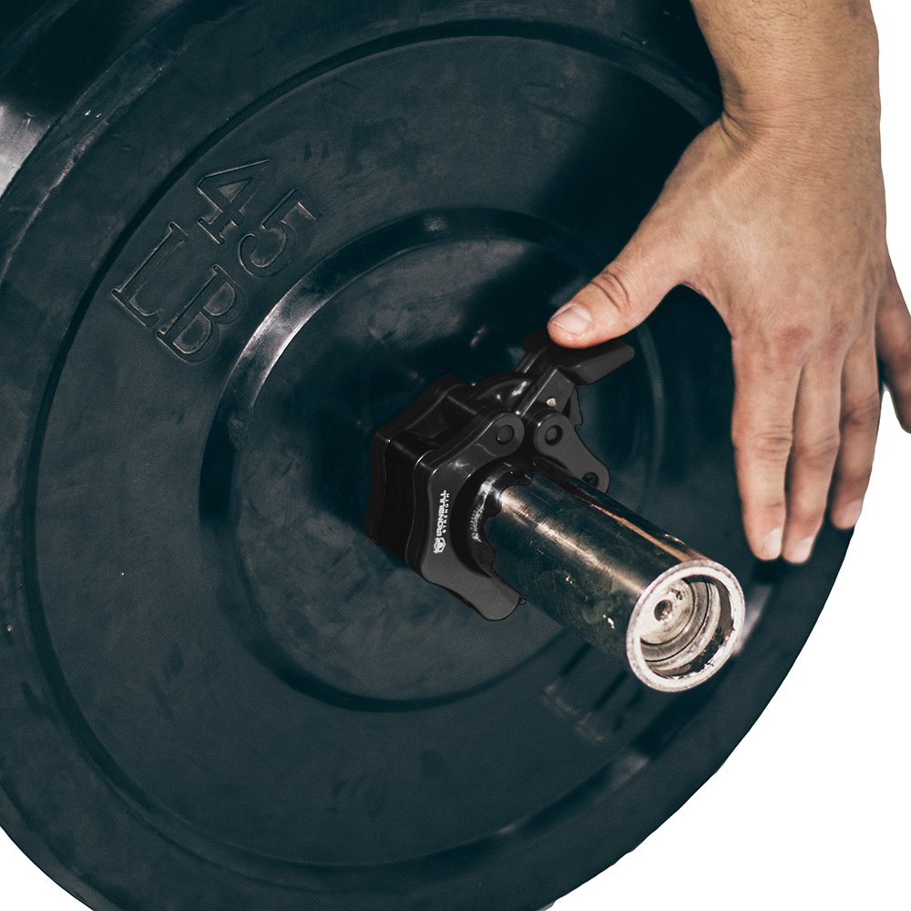
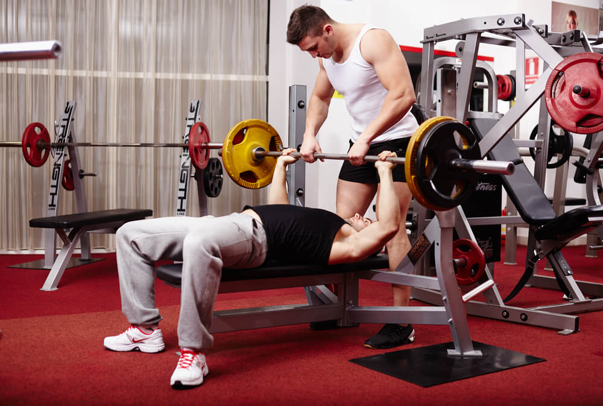
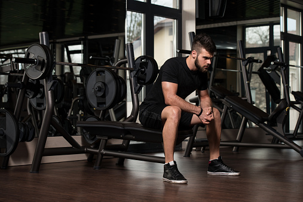
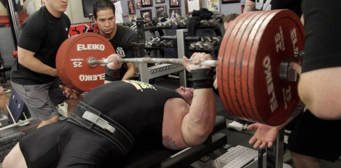
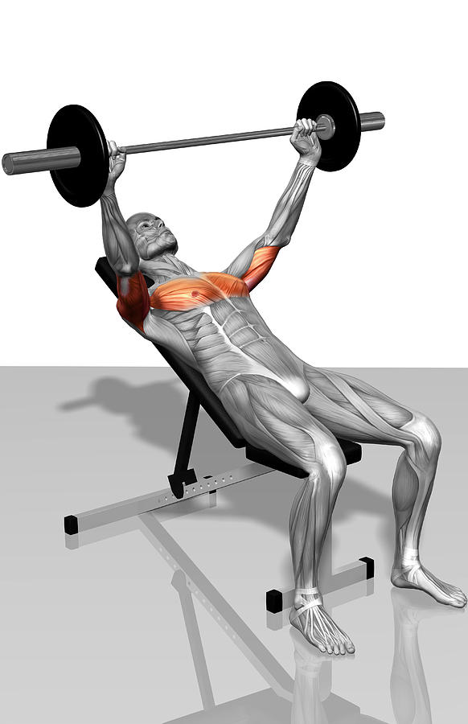

# How To Bench Press

Bench Press is one of the most widley recommended excersises for developing your pectoral muscles. Variations of the bench press can be used to target the three muscles that make up your chest, the clavicular part, sternocostal part and the abdominal part. Developing these muscles will give you that classic full chest look every guy strives for. 

## Required Materials 
- Weight Bench 
- Barbell
- Barbell Weight Plates 

## Steps 
1. Lie comfortably on the bench so that your eyes are in line with the barbell. 

2. Grab the barbell with both hands about six inches outside of your shoulder width.
 

3. Perform a warm-up set with just the weight of the barbell

    * Let the barbell down slowly so that it makes contact with your chest right above the sternum. 
    * Drive the barbell back into the starting position with explosive force. 

4. Re-Rack the barabell and add some weight. 
    -  Start with light weight untill you feel comfortable.
    -  Always use weight clips to keep the plates from sliding off the end of the barbell.

5. Find someone to spot you so that you don't injure yourself on a failed attempt to get the weight back up. 

6. Make sure to rest in between sets for at least 90 to 120 seconds. 

    - during this time, make sure to stay hydrated by drinking plenty of water. 
7. Progressively add more weight to promote muscle development. 

8. Now that you know the basics of bench pressing, experiment with the angle of the bench to target different parts of the chest!

